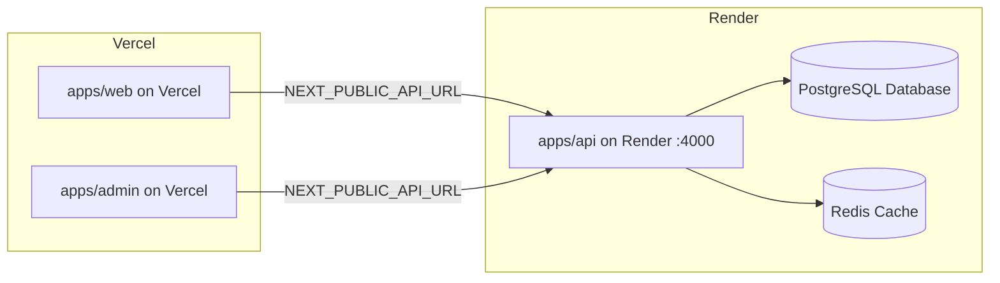

# ⚡ Connect Vercel (Frontends) to Render (Backend & Database)

This guide shows you how to host:
* **Backend API + PostgreSQL + Redis** on **Render**
* **Frontend Web & Client Portal** on **Vercel**
* **Staff CA Admin Console** on **Vercel**

---

## 🏗️ Architecture Overview



---

## 📋 Step 1: Deploy Backend & Database on Render

1. Deploy your repository on [Render](https://dashboard.render.com/blueprints) using our `render.yaml` blueprint (see [`RENDER_DEPLOY_GUIDE.md`](./RENDER_DEPLOY_GUIDE.md)).
2. Copy your **Render API URL** from the Render dashboard (e.g., `https://thabrez-api.onrender.com`).
3. Note down your base API endpoint:
   ```
   https://thabrez-api.onrender.com/api/v1
   ```

---

## 📋 Step 2: Deploy Marketing Site & Client Portal to Vercel

1. Go to **[vercel.com/new](https://vercel.com/new)**.
2. Select your GitHub repository: **`Mallem8704/thabrez-tax-consulting`**.
3. Under **Project Name**, enter: `thabrez-tax-consulting` (or `thabrez-web`).
4. Under **Root Directory**, click **Edit** and choose **`apps/web`**.
5. Keep **Framework Preset** as **Next.js**.
6. Expand **Environment Variables** and add the following 3 variables:

| Variable Name | Value |
| :--- | :--- |
| `NEXT_PUBLIC_API_URL` | `https://thabrez-api.onrender.com/api/v1` |
| `API_URL` | `https://thabrez-api.onrender.com/api/v1` |
| `NEXTAUTH_URL` | `https://your-project-name.vercel.app` *(or custom domain)* |
| `NEXTAUTH_SECRET` | `thabrez_super_secret_jwt_32_chars_random_string` |

7. Click **Deploy**.

---

## 📋 Step 3: Deploy Staff Admin Console to Vercel

1. In Vercel, click **Add New... -> Project** again.
2. Select the same repository: **`Mallem8704/thabrez-tax-consulting`**.
3. Under **Project Name**, enter: `thabrez-admin`.
4. Under **Root Directory**, click **Edit** and choose **`apps/admin`**.
5. Expand **Environment Variables** and add:

| Variable Name | Value |
| :--- | :--- |
| `NEXT_PUBLIC_API_URL` | `https://thabrez-api.onrender.com/api/v1` |
| `API_URL` | `https://thabrez-api.onrender.com/api/v1` |
| `NEXTAUTH_URL` | `https://thabrez-admin.vercel.app` *(or admin.yourdomain.com)* |
| `NEXTAUTH_SECRET` | `thabrez_super_secret_jwt_32_chars_random_string` |

6. Click **Deploy**.

---

## 🔒 Step 4: Verify Connection

1. Open your Vercel deployment: `https://thabrez-tax-consulting.vercel.app`.
2. Go to `/login` and sign in with demo credentials (`client@example.com` / `Client@1234`).
3. You will be authenticated against your Render NestJS API with full CORS support!
